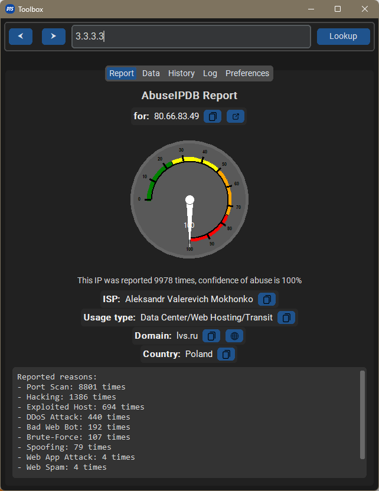

# DTS Toolbox
A small utility for automating boring SoC work. It automatically analyzes content in your clipboard and looks for information that you need.



## Features
- Automatically clipboard content lookup
- AbuseIPDB, VirusTotal, NIST CVE, MAC Address, Base64, LocalIP addresses and many more.
- Builtin OCR for extracting data from images, also great for collaboration on calls.

## Getting started
Install dependencies

```sh
pip install -r requirements.txt
```

## Configuration
This program needs a configuration file with API keys to work. Edit `config.ini` to add your API keys.

AbuseIPDB and VirusTotal keys are needed.

Further more, tesseract data is needed for OCR.

## Run the program
```sh
python main.py
```

## License
GPLv3