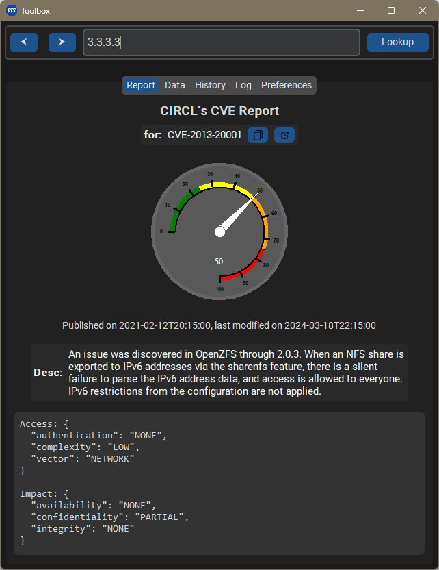

# DTS Toolbox
A small, cross-platform utility for automating boring SoC work. It automatically analyzes content in your clipboard and looks for information that you need.

 | 

## Features
- [x] Automatically clipboard content lookup
- [x] Proxy-aware for easy integration in corporate networks
- [x] Builtin OCR for extracting data from images, also great for collaboration on calls.

## Implemented processors
- [x] AbuseIPDB
- [x] VirusTotal
- [x] CIRCL CVE
- [x] MAC Address, Base64, LocalIP, DNS lookup, etc.

## Getting started
Install dependencies

```sh
pip install -r requirements.txt
```

## Configuration
This program needs a configuration file with API keys to work. Edit `config.ini` to add your API keys.
If you want to share the tool with your team, just setup your keys inside `server/main.py` and let DTS Toolbox connect to that tunnel.

```sh
cd server
pip install -r requirements.txt
python main.py
```

AbuseIPDB and VirusTotal keys are needed.

Further more, English tesseract data is needed for OCR.
Download here: [https://github.com/tesseract-ocr/tessdata/blob/main/eng.traineddata](https://github.com/tesseract-ocr/tessdata/blob/main/eng.traineddata)

## Run the program
```sh
python main.py
```

## License
GPLv3